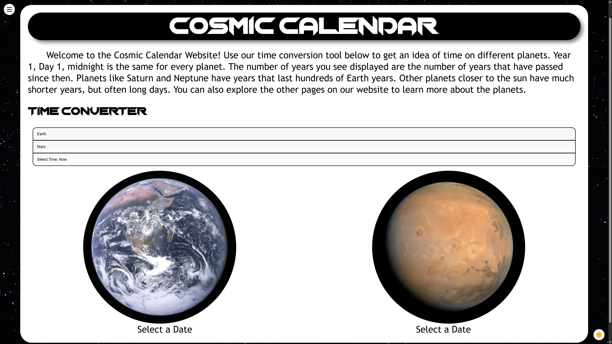
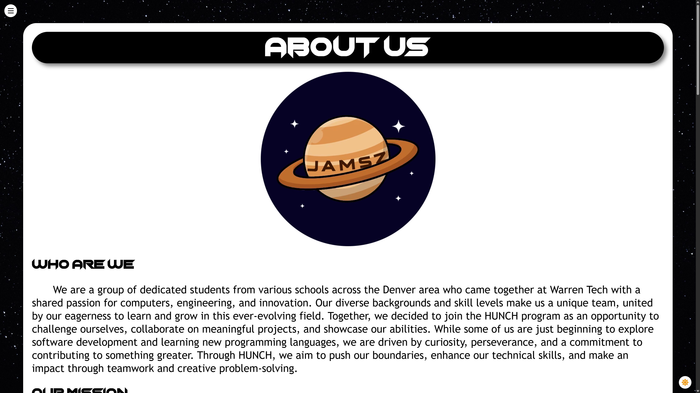
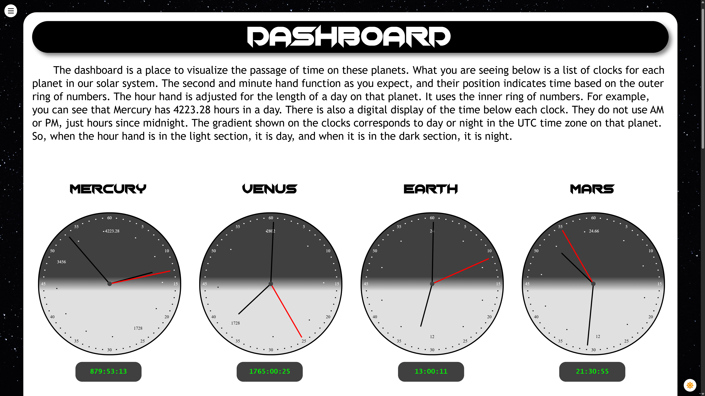

# Cosmic Calendar
## Background
NASA has a competition every year called NASA HUNCH. One of the prompts given in the 2024-2025 competition was the Cosmic Calendar.

## What it is
The Cosmic Calendar is a tool designed to allow seamless communication between celestial bodies in our solar system. The website uses the lengths of days and years on various celestial bodies in order to determine the time on each body. It provides tools to view and compare the times of different bodies, and contains miscellaneous background information about each body.

## Pages

### Home

The home page contains the time conversion tool, where you can select from a list of celestial bodies and any given time to view the current times on each celestial body and compare them to each other. Currently supported times range from Jan 1, year 1, midnight all the way to as far in the future as you wish, however keep in mind that the accuracy of our conversion very very slowly drifts further into the future due to the changing length of days and years on planets.

### About Us

This page is filled with background info about the project, our motivations, and overviews of the different people who contributed to this project.

### Dashboard

The dashboard provides a simple display of all of the celestial bodies' in the form of clocks. They are 24-hour clocks, which means that the hour hand makes one trip around the clock for every day that passes on that body. The clock starts at midnight at the top. The clocks proviode the current time on each planet, as well as displaying it digitally below each clock. Every clock has a different number of hours on them to compensate for the different length days on each planet.

### Planet History

Planet history does just what it's name suggests. It gives the user bits of info and history about each of the planets, as well as our sun and the other celestial bodies supported on our website. You view the facts by clicking on the image of the celestial body you wish to view.

## Currently Supported Celestial Bodies

### Planets
- Mercury
- Venus
- Earth
- Mars
- Jupiter
- Saturn
- Uranus
- Neptune

### Dwarf Planets
- Pluto
- Makemake

### Moons
- Europa
- Earth's Moon, Luna
- Titan

### Asteroids
- Ceres
- Vesta
- Pallas

## Sources
[JPLHorizons API](https://ssd.jpl.nasa.gov/horizons/)

[PlanetData](https://docs.google.com/spreadsheets/d/1pjtrW31uNtJV2MDW3coIcexl2HhT2Y_GUeu3iPE7YIE/edit?usp=sharing)

[Check out the website!](https://magicpotato854.github.io/Cosmic-Calendar-Website/)